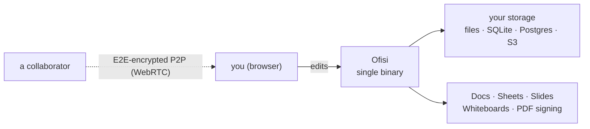
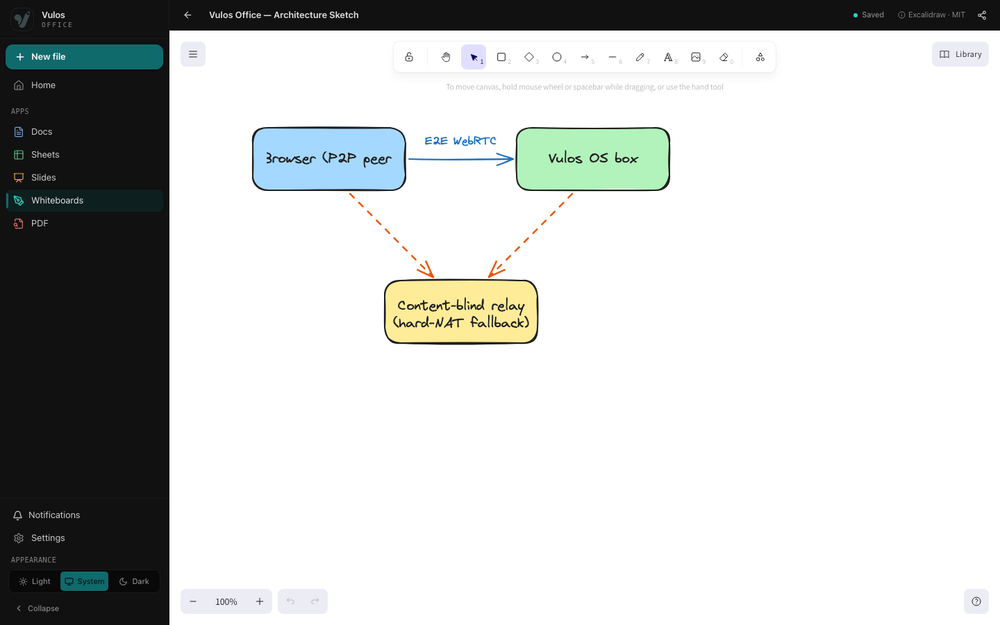
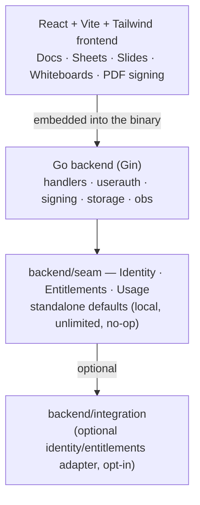

<div align="center">


# Ofisi

### A real, self-hostable collaborative office suite you own.

Documents, spreadsheets, slides, and whiteboards — **CRDT-native** and
**real-time**, shipped as a single binary, running on **your own storage**.
No cloud account, no telemetry, no lock-in.

[](LICENSE)
[](SELFHOST.md)
[](docs/COLLABORATION.md)
[](docs/TESTING.md)
[](https://golang.org)
[](https://react.dev)

[**Quickstart**](#quick-start) · [**Docs**](docs/) · [**Collaboration**](docs/COLLABORATION.md) · [**Architecture**](docs/ARCHITECTURE.md) · [**Self-hosting**](SELFHOST.md)

<br/>


</div>

---

## What is Ofisi?

Ofisi is a **standalone, self-hostable office suite** — documents, spreadsheets,
slides, and whiteboards in one clean, modern web app, shipped as a **single Go
binary** with the entire frontend embedded. There is no cloud account to create,
nothing phones home, and your files live in **your own storage**.

Real-time co-editing is **peer-to-peer and CRDT-native**: there is no central
document server. Peers sync directly over an end-to-end-encrypted channel, and
because edits are conflict-free (CRDTs), everyone converges with no authority in
the middle. What you run is what you own.

It carries the torch lit by **LibreOffice** and **OpenOffice** — the projects
that proved productivity software can be free, open, and community-driven — into
the browser, on a fast React frontend and a lightweight Go backend.



> *"Vula" — open the door. Ofisi is that door.*

---

## Features

| | |
|---|---|
| 📝 **Documents** | Rich-text editing (TipTap) — headings, tables, inline images, footnotes, task lists, links; anchored **comments**, **suggestions** (track-changes with accept/reject), **version history** with restore, find/replace, live outline + word count. |
| 📊 **Spreadsheets** | A full grid (Fortune Sheet) — formulas, number formats, conditional formatting, **data validation**, **charts**, **filters**, **pivot tables**, **named ranges**, freeze panes. |
| 🖼️ **Slides** | A from-scratch positioned-object canvas — free drag/resize/rotate of text, shapes, and images; per-element **animations**, **themes**, editable **master slides**, per-slide **transitions**, and a **presenter view** (notes + timer). |
| 🎨 **Whiteboards** | An infinite hand-drawn canvas built on the MIT [Excalidraw](https://github.com/excalidraw/excalidraw) editor — shapes, arrows, freehand, text, and images. The scene is a **Yjs CRDT** synced over the **same** E2E-encrypted P2P engine as Docs. |
| ⚡ **Real-time co-editing** | **Always peer-to-peer, no central document server.** Edits sync as CRDT updates inside an **end-to-end-encrypted** room; peers connect directly over WebRTC with a **content-blind relay** only as a hard-NAT fallback. Share by invite link — the key rides the URL fragment and never reaches any server. |
| 📄 **PDF import / export & signing** | Import and export `.docx` · `.xlsx` · `.csv` · `.pptx` · Markdown · HTML · **PDF**. View, annotate, fill AcroForm fields, and **sign** PDFs, including multi-party signing envelopes with a cryptographic audit trail. |
| 💾 **Your own storage** | Local files + SQLite by default; optional **PostgreSQL** (schema `office`) for multi-user; optional **S3-compatible** object store. Nothing is hosted for you unless you choose it. |
| 🔓 **No lock-in** | Open formats in and out, MIT-licensed, single self-contained binary. Every editor is also published as an npm library (`@vulos/office-client`) so you can embed any surface in your own app. |

Ofisi is **documents-only** by design: Docs, Sheets, Slides, Whiteboards, and
PDF signing. Chat, video, and mail are deliberately *not* part of it.

---

## Screenshots

|  |  |
| :---: | :---: |
| **Documents** — rich text, tables, comments | **Spreadsheets** — formulas, charts, pivots |
|  |  |
| **Slides** — themes, transitions, present | **Signing** — annotate & sign PDFs |
|  |  |
| **Whiteboards** — Excalidraw canvas, P2P CRDT | **Home** — workspace & recent files |
|  |  |

> Regenerate anytime with `npm run screenshots` — it boots the app with seeded
> demo data (no real backend or credentials needed). See [docs/SCREENSHOTS.md](docs/SCREENSHOTS.md).

---

## Quick start

Ofisi runs **by itself** — no account, no cloud, no external service required.

### Docker (one-liner)

```bash
docker run -d \
  --name ofisi \
  -p 8080:8080 \
  -v ofisi-data:/srv/data \
  ghcr.io/vul-os/ofisi:latest
```

Open <http://localhost:8080>.

### From source (single binary)

Prerequisites: [Go 1.25+](https://golang.org/dl/) and [Node.js 18+](https://nodejs.org/) with npm.

```bash
git clone https://github.com/vul-os/ofisi.git
cd ofisi

# Install deps and build the frontend + single binary
npm install
npm run build

# Run — single-user, local storage, no auth, no cloud
./vulos-office
```

Open <http://localhost:8080>. Data lives in `./data` and `./uploads` — that's the
whole app, in one file. To require login (still fully standalone):

```bash
# config.yaml → auth.enabled: true
export VULOS_OFFICE_JWT_SECRET="$(openssl rand -hex 32)"
./vulos-office
```

### Develop

```bash
npm run dev:web   # Vite dev server (:5173) + Go API (:8080), live reload
```

Open <http://localhost:5173>.

### Install from the Vulos app store

Ofisi also installs as a one-click app on a **Vulos OS** box (`DEPLOY_MODE=os`),
where it runs behind the box gateway with scoped storage and single sign-on. It
is the **same binary** — the app store just wires identity and storage for you.
Self-hosting it yourself is always the default path, and never second-class.

---

## Architecture



Ofisi is a **single Go binary with the whole frontend embedded** — one file to
deploy. With zero configuration it runs as a single-user, local-storage app on
your own machine. Everything that *could* tie it to an external service lives
behind a small set of Go interfaces in `backend/seam`; the standalone build
wires local, unlimited, no-op defaults and never imports the optional adapter.

Real-time collaboration is **CRDT-based and always peer-to-peer**: Docs and
whiteboards sync as Yjs updates, Sheets and Slides use LWW/tree CRDTs, all inside
an end-to-end-encrypted room whose key never reaches any server. The only server
role is **content-blind peer discovery** — it learns *that* peers share a random
room id, never any content. See [docs/COLLABORATION.md](docs/COLLABORATION.md)
and [docs/ARCHITECTURE.md](docs/ARCHITECTURE.md).

---

## Documentation

Full documentation lives in **[`docs/`](docs/)**.

| Document | Description |
|----------|-------------|
| [Getting started](docs/GETTING-STARTED.md) | Run it locally, in Docker, or in production |
| [Self-hosting](SELFHOST.md) | Run fully standalone; the optional identity/entitlements seam |
| [Collaboration](docs/COLLABORATION.md) | How real-time P2P CRDT editing works, end to end |
| [Architecture](docs/ARCHITECTURE.md) | Component map and design decisions |
| [Configuration](docs/CONFIGURATION.md) | Env vars, `config.yaml`, storage, OTEL reference |
| [API](docs/API.md) | REST API — files, versions, collab, signing |
| [Admin guide](docs/ADMIN-GUIDE.md) | Deploy, back up, and operate the server |
| [Deploy](docs/DEPLOY.md) | Docker, single-box co-location, static CDN |
| [Testing](docs/TESTING.md) | Vitest unit + RTL/MSW integration, Playwright E2E |
| [Roadmap](ROADMAP.md) · [Changelog](CHANGELOG.md) | Plans and version history |

---

## Development

```bash
npm run dev:web        # Vite (:5173) + Go API (:8080)
npm test               # unit + RTL/MSW integration tests (Vitest)
npm run test:e2e       # browser E2E (Playwright)
npm run build          # frontend dist/ + Go binary
npm run screenshots    # regenerate the docs/screenshots gallery

go build ./...  &&  go test ./...  &&  go vet ./...
```

> **Frozen invariants:** pure Go (no CGO), JSX only (never `.tsx`), no third-party
> SSO or payment lock-in in the standalone build. See [CONTRIBUTING.md](CONTRIBUTING.md).

---

## Security

Ofisi centralises HTML sanitisation in one audited DOMPurify policy, treats CRDT
ingress as fail-closed, gates read-only collaborators cryptographically, and
enforces per-file ACLs when multi-user auth is on. Found a vulnerability? Please
report it **privately** — see [SECURITY.md](SECURITY.md), [THREAT-MODEL.md](THREAT-MODEL.md),
and [SECURITY-TESTING.md](SECURITY-TESTING.md). Do not open public issues for
security reports.

---

## Contributing

Pull requests are welcome — bug fixes, signing robustness, accessibility, tests,
and docs especially. For major changes, open an issue first. See
[CONTRIBUTING.md](CONTRIBUTING.md) for setup, code style, and the frozen
invariants. No CLA required.

---

## License

[MIT](LICENSE) — free to use, modify, and distribute. Ofisi is yours.

---

<div align="center">

<sub><strong>Ofisi</strong> · A real, self-hostable collaborative office suite you own. · Open by design.</sub>

</div>
