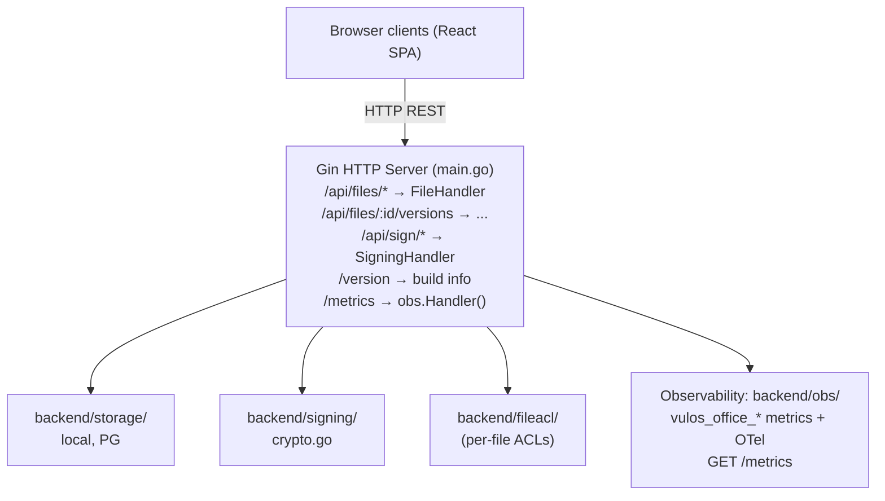

# Ofisi – Architecture

## Overview

Ofisi is a collaborative document editing + e-signing service. It exposes:
- File CRUD with version history
- REST persistence plus real-time collaboration (comments, suggestions, live
  co-editing). Live co-editing is always peer-to-peer over one E2E-encrypted
  room, in two CRDT flavours — see the note below
- E-signing workflow (envelope → sign → sealed PDF)

> **Scope:** Ofisi is documents-only (Docs, Sheets, Slides, Whiteboards, PDF/Signing). Calendar
> and Contacts come from the bring-your-own-mailbox PIM connector (lilmail
> CalDAV/CardDAV + lilmail `/v1/calendar` + `/v1/contacts`), surfaced by the OS as
> standalone widgets. Chat and video are third-party (Matrix/Element; Element Call /
> Jitsi), not Vulos products. The Vulos OS is the shell that hosts the apps.

> **Collaboration transport note:** Live co-editing is CRDT-based and runs
> **entirely peer-to-peer — there is NO central document server.** The Ofisi
> binary hosts no op-relay, no doc-state hub, and no server-mediated collab
> endpoint (confirmed in `main.go` at the `/v1` route block: "Office
> collaboration is ALWAYS peer-to-peer … deliberately NO central document
> server"). There are **two CRDT session flavours**, both riding the **same**
> end-to-end-encrypted room (`src/lib/crdt/p2pRoom.js`) over the same
> `@vulos/relay-client` fabric transport:
> - **Yjs session** (`YP2PCollabSession`, `src/lib/crdt/yP2PSession.js`) — the
>   structure-aware path used by **Docs**. The document is a Yjs document
>   (`src/lib/crdt/ydoc.js`), kept in lock-step with ProseMirror by
>   y-prosemirror; peers exchange Yjs updates + state-vector resyncs. The
>   whiteboard document type rides the same session with an Excalidraw-scene
>   validator (`boardYdoc.js`).
> - **Custom-CRDT session** (`P2PCollabSession`, `src/lib/crdt/p2pSession.js`) —
>   the hand-rolled CRDT path (text RGA, grid LWW, tree fractional-index —
>   `src/lib/crdt/{text,grid,tree}.js`) with an `{op, snap-req, snap}` wire
>   vocabulary and offline-buffer-then-sync convergence.
> - In both cases peers connect **directly** over WebRTC data channels
>   (STUN-assisted); a **content-blind relay** circuit is used only as a hard-NAT
>   fallback (per-session X25519 box — ciphertext only). Frames are sealed
>   AES-256-GCM under an HKDF-derived room key carried in the URL **fragment**
>   (`#vp2p=…`), which never reaches any server.
> - **Presence** (cursors + roster) rides the **same E2E room**, so the host never
>   learns who is in a room; it is ephemeral and never persisted. A read-only peer
>   holds the decryption key but not the RW-authority MAC, so its writes are
>   cryptographically refused.
> - **The only server role** is content-blind peer **discovery** (signaling + ICE
>   at `/api/peering/*`), provided by the host (Vulos OS / Relay) — never document
>   content. A bare standalone binary mounts none of it, so collaboration stays
>   **local-only** and autosaves; the UI reports "Offline" honestly.
>
> Ingress is validated **fail-closed**: every untrusted update is shadow-applied,
> converted against the real schema, and image/link-clamped before it can touch
> the live document (malformed/oversized/unrenderable updates drop, never throw).

## Component Map

## Key Design Decisions

- **Gin framework**: chosen for its middleware ecosystem and existing codebase.
- **Client-side CRDT modules** (`src/lib/crdt/`): all merge logic lives in the
  browser — there is no server-side CRDT. Two families coexist:
  - **Yjs** (`ydoc.js`, `yP2PSession.js`) — the structure-aware path Docs (and
    the whiteboard document type) use; converges with no central authority.
  - **Hand-rolled CRDTs** — text (RGA, `text.js`), grid (LWW, `grid.js`), tree
    (fractional-index, `tree.js`), plus comment/suggestion ordering — for
    ordering + offline-tolerant merge, driven by the custom-CRDT P2P session
    (`p2pSession.js`).

  Both families sync over the **single** collab transport: the E2E-encrypted
  peer-to-peer room (`p2pRoom.js`) on the `@vulos/relay-client` fabric. There is
  no server-mediated collab transport (no SSE op-stream, no doc-state hub) — the
  server's only collaboration role is content-blind peer discovery.
- **Durability — whole-doc PUT + optional CRDT update log**: the primary store is
  a whole-document blob (`PUT /api/files/:id`) guarded by an optimistic-concurrency
  rev (a stale write is a `409` the client reconciles). Layered on top — behind
  `persistence.updatelog` (`backend/updatelog/`) — is a **per-file append-only
  CRDT update log** (`GET`/`POST /api/files/:id/updates`): every CRDT frame
  (opaque, encrypted-or-plain Yjs / sheet / slide update) is kept with a monotonic
  seq, and a client periodically posts a compacting `snapshot` frame (whole state +
  a `floor` seq) so the server can prune the frames it subsumes — while preserving
  any frame above the floor. Because CRDT updates are commutative + idempotent,
  replaying snapshot+frames converges byte-identically no matter how peers diverged
  offline, so this supersedes last-writer-wins for durability. It is **additive**:
  the frontend dual-writes (whole-doc autosave AND frame append), so the flag can be
  toggled without losing a document. The server stays content-blind (frames are
  opaque bytes).
  - **Store backends** mirror the primary storage choice: **local/S3 storage →
    filesystem `LocalStore`** (`data/updates/<id>/`), **postgres storage →
    `PostgresStore`** (`office.file_updates` + `office.file_update_snapshots`,
    sharing the storage pool). The Postgres append derives its monotonic per-file
    seq under a transaction-scoped **per-file advisory lock**, and the snapshot
    upsert + frame prune run in the same transaction (S3 has no append-with-
    monotonic-seq primitive, so it falls back to the filesystem log).
  - **Frames are metered**: an append passes the **same storage-quota gate** as
    the whole-doc PUT (`billing.GateStorage`), so the log is not a quota bypass
    (standalone/unlimited → no-op).
  - **Editors wired**: Docs and Whiteboard (both plain Y.Docs) use the Yjs
    `UpdateLogSync`; Sheets (LWW grid) and Slides (fractional tree) are op-based
    CRDTs and use `OpLogSync`, which carries discrete ops as frames and the
    compacted state as snapshot frames.
  - **Server-side compaction is advisory only**: the server *cannot* fold opaque
    CRDT frames into a snapshot (it cannot interpret them). When a file's
    un-compacted tail exceeds `updatelog.CompactAdviseThreshold` the append
    response carries `compact: true` (a throttled WARN is also logged) and the
    client compacts. Client-driven compaction stays primary.
- **E-signing**: PDF is sealed with a cryptographic hash; audit manifest JSON captures all signer events.
- **Auth**: JWT-based; configurable (`cfg.Auth.Enabled`). Per-user credentials stored in
  pure-Go SQLite (`backend/userauth/`).
- **Storage**: pluggable interface — local JSON (default), PostgreSQL (multi-user), or
  S3-compatible object store (BYO/Tigris).
- **Deploy modes** (`backend/deploymode/`, `DEPLOY_MODE`): exactly two — `standalone`
  (default; a fully sovereign self-host with no OS gateway in front — all features
  open, no billing/entitlement gating, blob I/O via the process-wide object client
  or a silent no-op) and `os` (Ofisi running as an app **behind a Vulos OS box
  gateway**). Ofisi is never multi-tenant cloud-hosted; the cloud runs Mail + Relay
  + the control plane only. In `os` mode the process **refuses to boot** without an
  authenticated posture (native auth or SSO introspection) so a hosted deployment can
  never silently collapse every caller onto one shared identity.
- **Storage seam** (`backend/storage/seam_client.go`, `backend/handlers/bucket_store.go`):
  in `os` mode the gateway injects per-request `X-Vulos-Storage-*` headers describing a
  short-lived, per-user S3 slice, so Ofisi never holds full-bucket credentials. The
  headers are honoured **only** when the request also carries a valid
  `X-Vulos-Storage-Broker-Auth` matching `VULOS_STORAGE_BROKER_SECRET` (constant-time),
  and the injected endpoint is SSRF-checked (`ValidateSeamEndpoint`: https always,
  http only for loopback/private hosts). Otherwise the seam headers are ignored and
  Ofisi falls back to the standalone object client. In every mode blob keys are built
  by `storage.OrgScopedKey(accountID, name)`, which scopes each object under its
  owning account and sanitises every segment so a caller-influenced id can never inject
  a path separator or `..` and escape into another account's namespace.
- **Org-bucket wiring**: `backend/storage/backendconfig.go` carries `OfficeBackendConfig`
  for the S3 bucket + CRDT snapshot configuration used by the standalone object client.
- **Per-file ACLs**: `backend/fileacl/` enforces per-file read/write/admin permissions
  backed by SQLite or Postgres (co-located with the file store). Identity is always the
  server-verified requester (JWT subject / SSO tenant), never a client header, and a
  denied file op returns `404` so responses never leak whether a file exists.

## See Also

- Deployment: `docs/DEPLOY.md`
- Install (single-box with Vulos OS): `docs/INSTALL.md`
- Versioning & release: `docs/RELEASING.md`
- Security model: `SECURITY.md`, `THREAT-MODEL.md`
