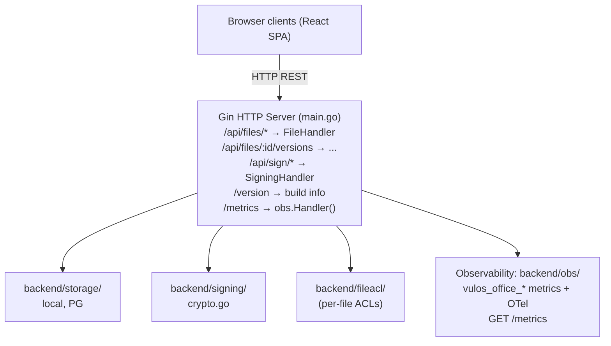

# Vulos Office – Architecture

## Overview

Vulos Office is a collaborative document editing + e-signing service. It exposes:
- File CRUD with version history
- REST persistence plus real-time collaboration (comments, suggestions, live
  co-editing) over three complementary transports — see the note below
- E-signing workflow (envelope → sign → sealed PDF)

> **Scope:** Office is documents-only (Docs, Sheets, Slides, PDF/Signing). Calendar
> and Contacts moved to the **Vulos Mail/PIM** product (vulos-mail CalDAV/CardDAV +
> lilmail `/v1/calendar` + `/v1/contacts`). Video (Meet) lives in `vulos-meet` and
> chat/spaces (Talk) lives in `vulos-talk`. Vulos Workspace is the suite shell that
> combines the products.

> **Collaboration transport note:** Live co-editing is CRDT-based and runs over
> **three complementary transports**, all wired today:
> 1. **Server-mediated (SSE)** — `ServerCollabSession` streams ops over
>    `GET /api/…/collab/stream` (down) + `POST …/collab/ops` (up), ACL-gated and
>    persisted authoritatively. This is the always-on account path; it keeps a
>    doc converging and saved even with zero peers.
> 2. **Cloud P2P fabric (plaintext)** — `DocsCollabSession`/`GridSession`/
>    `TreeSession` fan ops over the Vulos peer fabric (WebRTC + relay fallback)
>    for low-latency co-editing when peers can connect.
> 3. **E2E P2P (encrypted invite-link)** — `P2PCollabSession` seals ops with
>    AES-256-GCM (HKDF-derived room key carried in the URL fragment, never sent
>    to the server); the server path is suppressed while this is active so
>    encrypted ops never traverse a readable relay.
>
> All three share the same idempotent/commutative `TextCRDT` (RGA) base, so ops
> arriving from more than one transport converge without double-apply. Remote-op
> ingress is validated **fail-closed** (malformed/oversized ops drop, never throw).

## Component Map

## Key Design Decisions

- **Gin framework**: chosen for its middleware ecosystem and existing codebase.
- **Client-side CRDT modules** (`src/lib/crdt/`): text (RGA), grid (LWW), tree
  (fractional-index), comment, and suggestion CRDTs run in the browser for
  ordering + offline-tolerant merge, and drive live sync over all three collab
  transports (server-SSE, cloud-fabric P2P, E2E-encrypted P2P). The text RGA
  mirrors the Go `backend/crdt/text.go` for interop.
- **E-signing**: PDF is sealed with a cryptographic hash; audit manifest JSON captures all signer events.
- **Auth**: JWT-based; configurable (`cfg.Auth.Enabled`). Per-user credentials stored in
  pure-Go SQLite (`backend/userauth/`).
- **Storage**: pluggable interface — local JSON (default), PostgreSQL (multi-user), or
  S3-compatible object store (BYO/Tigris).
- **Org-bucket wiring**: `backend/storage/backendconfig.go` carries `OfficeBackendConfig`
  for per-org S3 bucket + CRDT snapshot configuration, injected by the Vulos control plane.
- **Per-file ACLs**: `backend/fileacl/` enforces per-file read/write/admin permissions
  backed by SQLite or Postgres (co-located with the file store).

## See Also

- Deployment: `docs/DEPLOY.md`
- Install (single-box with Vulos OS): `docs/INSTALL.md`
- Versioning & release: `docs/RELEASING.md`
- Security model: `SECURITY.md`, `THREAT-MODEL.md`
