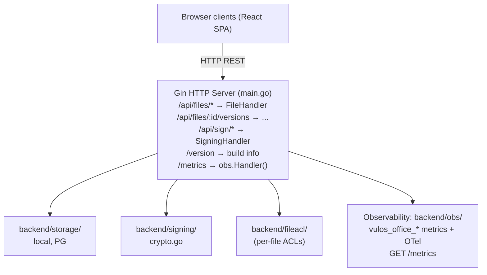

# Ofisi – Architecture

## Overview

Ofisi is a collaborative document editing + e-signing service. It exposes:
- File CRUD with version history
- REST persistence plus real-time collaboration (comments, suggestions, live
  co-editing) over three complementary transports — see the note below
- E-signing workflow (envelope → sign → sealed PDF)

> **Scope:** Ofisi is documents-only (Docs, Sheets, Slides, Whiteboards, PDF/Signing). Calendar
> and Contacts come from the bring-your-own-mailbox PIM connector (lilmail
> CalDAV/CardDAV + lilmail `/v1/calendar` + `/v1/contacts`), surfaced by the OS as
> standalone widgets. Chat and video are third-party (Matrix/Element; Element Call /
> Jitsi), not Vulos products. The Vulos OS is the shell that hosts the apps.

> **Collaboration transport note:** Live co-editing is CRDT-based and runs
> **entirely peer-to-peer — there is NO central document server.** The Ofisi
> binary hosts no op-relay, no doc-state hub, and no server-mediated collab
> endpoint.
> - **The document** rides an **end-to-end-encrypted room** as **Yjs** updates
>   (`YP2PCollabSession`, `src/lib/crdt/yP2PSession.js`). Peers connect **directly**
>   over WebRTC data channels (STUN-assisted); a **content-blind relay** circuit is
>   used only as a hard-NAT fallback (per-session X25519 box — ciphertext only).
>   Frames are sealed AES-256-GCM under an HKDF-derived room key carried in the URL
>   **fragment** (`#vp2p=…`), which never reaches any server.
> - **Presence** (cursors + roster) rides the **same E2E room**, so the host never
>   learns who is in a room; it is ephemeral and never persisted. A read-only peer
>   holds the decryption key but not the RW-authority MAC, so its writes are
>   cryptographically refused.
> - **The only server role** is content-blind peer **discovery** (signaling + ICE
>   at `/api/peering/*`), provided by the host (Vulos OS / Relay) — never document
>   content. A bare standalone binary mounts none of it, so collaboration stays
>   **local-only** and autosaves; the UI reports "Offline" honestly.
>
> Ingress is validated **fail-closed**: every untrusted update is shadow-applied,
> converted against the real schema, and image/link-clamped before it can touch
> the live document (malformed/oversized/unrenderable updates drop, never throw).

## Component Map

## Key Design Decisions

- **Gin framework**: chosen for its middleware ecosystem and existing codebase.
- **Client-side CRDT modules** (`src/lib/crdt/`): text (RGA), grid (LWW), tree
  (fractional-index), comment, and suggestion CRDTs run in the browser for
  ordering + offline-tolerant merge, and drive live sync over all three collab
  transports (server-SSE, cloud-fabric P2P, E2E-encrypted P2P). The text RGA
  mirrors the Go `backend/crdt/text.go` for interop.
- **E-signing**: PDF is sealed with a cryptographic hash; audit manifest JSON captures all signer events.
- **Auth**: JWT-based; configurable (`cfg.Auth.Enabled`). Per-user credentials stored in
  pure-Go SQLite (`backend/userauth/`).
- **Storage**: pluggable interface — local JSON (default), PostgreSQL (multi-user), or
  S3-compatible object store (BYO/Tigris).
- **Deploy modes** (`backend/deploymode/`, `DEPLOY_MODE`): exactly two — `standalone`
  (default; a fully sovereign self-host with no OS gateway in front — all features
  open, no billing/entitlement gating, blob I/O via the process-wide object client
  or a silent no-op) and `os` (Ofisi running as an app **behind a Vulos OS box
  gateway**). Ofisi is never multi-tenant cloud-hosted; the cloud runs Mail + Relay
  + the control plane only. In `os` mode the process **refuses to boot** without an
  authenticated posture (native auth or SSO introspection) so a hosted deployment can
  never silently collapse every caller onto one shared identity.
- **Storage seam** (`backend/storage/seam_client.go`, `backend/handlers/bucket_store.go`):
  in `os` mode the gateway injects per-request `X-Vulos-Storage-*` headers describing a
  short-lived, per-user S3 slice, so Ofisi never holds full-bucket credentials. The
  headers are honoured **only** when the request also carries a valid
  `X-Vulos-Storage-Broker-Auth` matching `VULOS_STORAGE_BROKER_SECRET` (constant-time),
  and the injected endpoint is SSRF-checked (`ValidateSeamEndpoint`: https always,
  http only for loopback/private hosts). Otherwise the seam headers are ignored and
  Ofisi falls back to the standalone object client. In every mode blob keys are built
  by `storage.OrgScopedKey(accountID, name)`, which scopes each object under its
  owning account and sanitises every segment so a caller-influenced id can never inject
  a path separator or `..` and escape into another account's namespace.
- **Org-bucket wiring**: `backend/storage/backendconfig.go` carries `OfficeBackendConfig`
  for the S3 bucket + CRDT snapshot configuration used by the standalone object client.
- **Per-file ACLs**: `backend/fileacl/` enforces per-file read/write/admin permissions
  backed by SQLite or Postgres (co-located with the file store). Identity is always the
  server-verified requester (JWT subject / SSO tenant), never a client header, and a
  denied file op returns `404` so responses never leak whether a file exists.

## See Also

- Deployment: `docs/DEPLOY.md`
- Install (single-box with Vulos OS): `docs/INSTALL.md`
- Versioning & release: `docs/RELEASING.md`
- Security model: `SECURITY.md`, `THREAT-MODEL.md`
