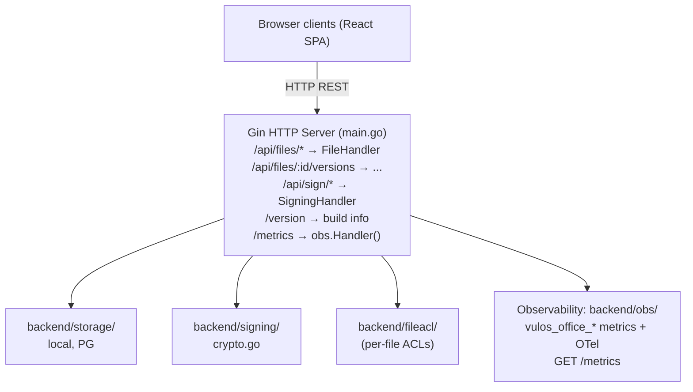

# Vulos Office – Architecture

## Overview

Vulos Office is a collaborative document editing + e-signing service. It exposes:
- File CRUD with version history
- REST persistence plus real-time collaboration (comments, suggestions, live
  co-editing) over three complementary transports — see the note below
- E-signing workflow (envelope → sign → sealed PDF)

> **Scope:** Office is documents-only (Docs, Sheets, Slides, PDF/Signing). Calendar
> and Contacts moved to the **Vulos Mail/PIM** product (vulos-mail CalDAV/CardDAV +
> lilmail `/v1/calendar` + `/v1/contacts`). Video (Meet) lives in `vulos-meet` and
> chat/spaces (Talk) lives in `vulos-talk`. The Vulos OS is the shell that hosts the
> apps; the Vulos Workspace hub app consolidates them into one cockpit.

> **Collaboration transport note:** Live co-editing is CRDT-based and runs over
> **three complementary transports**, all wired today:
> 1. **Server-mediated (SSE)** — `ServerCollabSession` streams ops over
>    `GET /v1/documents/:id/collab/stream` (down) + `POST …/collab/ops` (up),
>    ACL-gated and persisted authoritatively. This is the always-on account path;
>    it keeps a doc converging and saved even with zero peers. **Live presence**
>    (cursors + roster) rides the same path via `POST …/collab/presence`
>    (`VIEWER+`, identity-stamped server-side, **ephemeral / never persisted**),
>    so "who is here" + live carets work on the cloud path with **no p2p peer**.
>    Presence is fanned out strictly per-doc (no cross-doc leakage) and is merged
>    with the p2p roster so a peer is never double-counted.
> 2. **Cloud P2P fabric (plaintext)** — `DocsCollabSession`/`GridSession`/
>    `TreeSession` fan ops over the Vulos peer fabric (WebRTC + relay fallback)
>    for low-latency co-editing when peers can connect.
> 3. **E2E P2P (encrypted invite-link)** — `P2PCollabSession` seals ops with
>    AES-256-GCM (HKDF-derived room key carried in the URL fragment, never sent
>    to the server); the server path is suppressed while this is active so
>    encrypted ops never traverse a readable relay.
>
> All three share the same idempotent/commutative `TextCRDT` (RGA) base, so ops
> arriving from more than one transport converge without double-apply. Remote-op
> ingress is validated **fail-closed** (malformed/oversized ops drop, never throw).

## Component Map

## Key Design Decisions

- **Gin framework**: chosen for its middleware ecosystem and existing codebase.
- **Client-side CRDT modules** (`src/lib/crdt/`): text (RGA), grid (LWW), tree
  (fractional-index), comment, and suggestion CRDTs run in the browser for
  ordering + offline-tolerant merge, and drive live sync over all three collab
  transports (server-SSE, cloud-fabric P2P, E2E-encrypted P2P). The text RGA
  mirrors the Go `backend/crdt/text.go` for interop.
- **E-signing**: PDF is sealed with a cryptographic hash; audit manifest JSON captures all signer events.
- **Auth**: JWT-based; configurable (`cfg.Auth.Enabled`). Per-user credentials stored in
  pure-Go SQLite (`backend/userauth/`).
- **Storage**: pluggable interface — local JSON (default), PostgreSQL (multi-user), or
  S3-compatible object store (BYO/Tigris).
- **Deploy modes** (`backend/deploymode/`, `DEPLOY_MODE`): exactly two — `standalone`
  (default; a fully sovereign self-host with no OS gateway in front — all features
  open, no billing/entitlement gating, blob I/O via the process-wide object client
  or a silent no-op) and `os` (Office running as an app **behind a Vulos OS box
  gateway**). Office is never multi-tenant cloud-hosted; the cloud runs Mail + Relay
  + the control plane only. In `os` mode the process **refuses to boot** without an
  authenticated posture (native auth or SSO introspection) so a hosted deployment can
  never silently collapse every caller onto one shared identity.
- **Storage seam** (`backend/storage/seam_client.go`, `backend/handlers/bucket_store.go`):
  in `os` mode the gateway injects per-request `X-Vulos-Storage-*` headers describing a
  short-lived, per-user S3 slice, so Office never holds full-bucket credentials. The
  headers are honoured **only** when the request also carries a valid
  `X-Vulos-Storage-Broker-Auth` matching `VULOS_STORAGE_BROKER_SECRET` (constant-time),
  and the injected endpoint is SSRF-checked (`ValidateSeamEndpoint`: https always,
  http only for loopback/private hosts). Otherwise the seam headers are ignored and
  Office falls back to the standalone object client. In every mode blob keys are built
  by `storage.OrgScopedKey(accountID, name)`, which scopes each object under its
  owning account and sanitises every segment so a caller-influenced id can never inject
  a path separator or `..` and escape into another account's namespace.
- **Org-bucket wiring**: `backend/storage/backendconfig.go` carries `OfficeBackendConfig`
  for the S3 bucket + CRDT snapshot configuration used by the standalone object client.
- **Per-file ACLs**: `backend/fileacl/` enforces per-file read/write/admin permissions
  backed by SQLite or Postgres (co-located with the file store). Identity is always the
  server-verified requester (JWT subject / SSO tenant), never a client header, and a
  denied file op returns `404` so responses never leak whether a file exists.

## See Also

- Deployment: `docs/DEPLOY.md`
- Install (single-box with Vulos OS): `docs/INSTALL.md`
- Versioning & release: `docs/RELEASING.md`
- Security model: `SECURITY.md`, `THREAT-MODEL.md`
