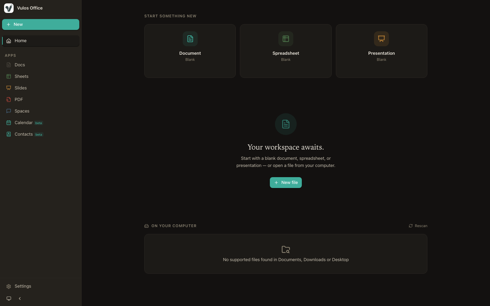
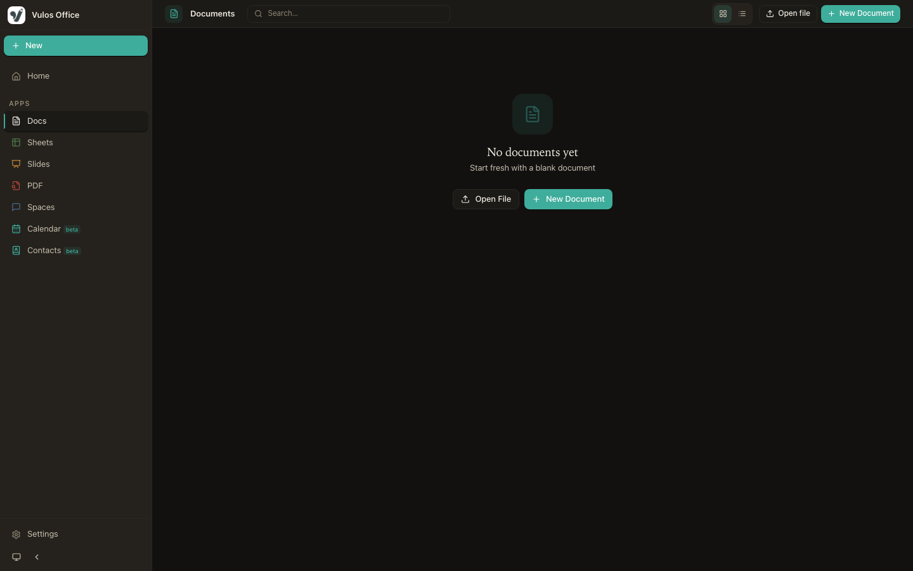
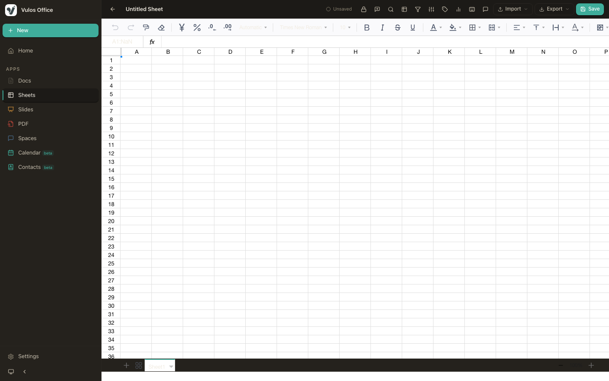
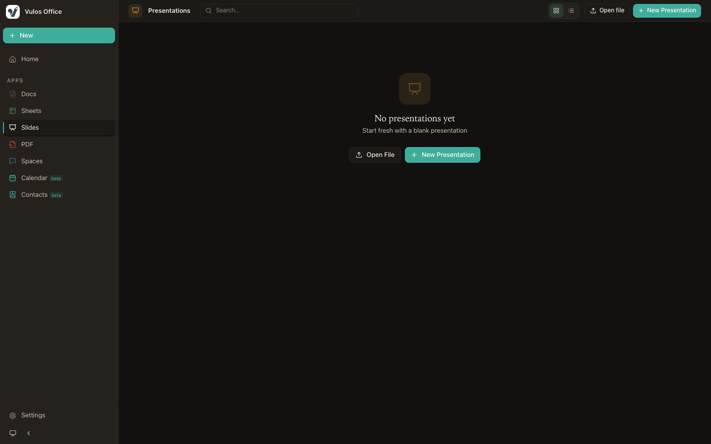
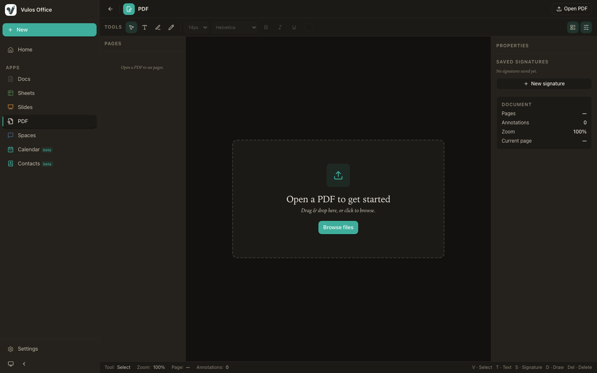
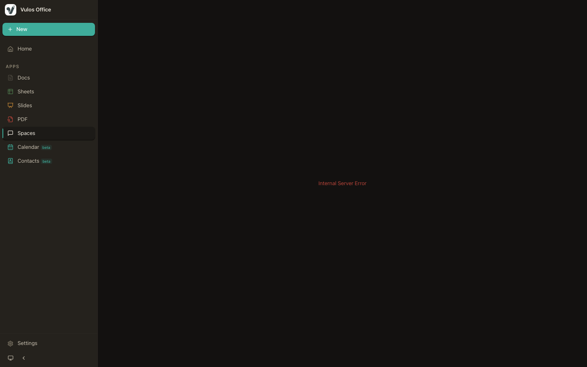
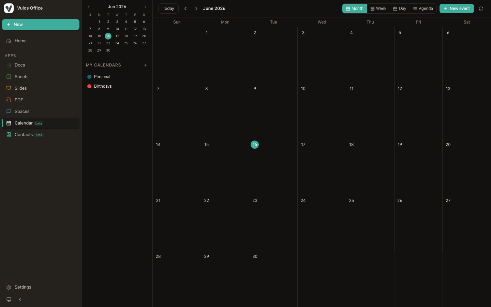
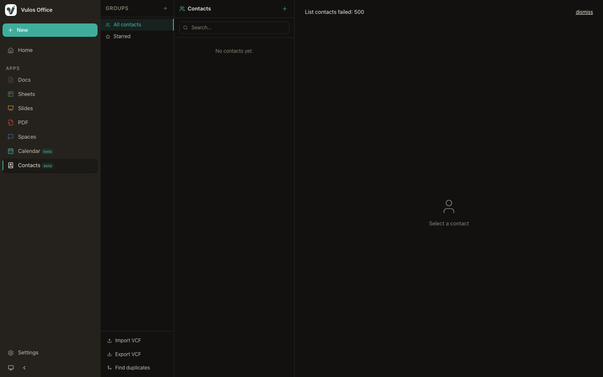
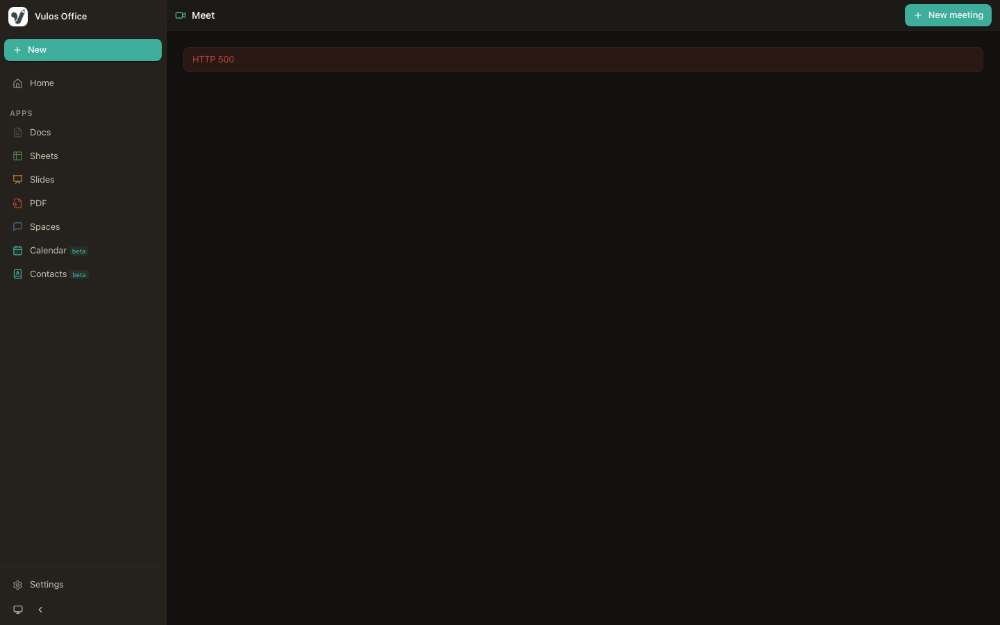

# Vulos Office — Screenshots

This document describes the screenshot gallery, how screenshots are captured, and which views require a live backend instance.

---

## Prerequisites

```bash
# Install npm dependencies (including Playwright)
npm install

# Install Playwright's Chromium browser
npx playwright install chromium
```

---

## Capturing screenshots

```bash
# Start the dev server in one terminal
npm run dev:web

# In another terminal, run the screenshotter
npm run screenshots
```

Screenshots are saved to `docs/screenshots/*.png` at 1440×900.

To capture against a deployed instance:

```bash
BASE_URL=https://office.example.com npm run screenshots
```

---

## Route list

| File | Route | Surface | Needs backend? |
|------|-------|---------|----------------|
| `hero.png` | `/` | Home / file list | No (static shell) |
| `home.png` | `/` | Home | No |
| `docs-editor.png` | `/docs/demo` | Documents editor | No (client-side) |
| `sheets-editor.png` | `/sheets/demo` | Spreadsheets editor | No (client-side) |
| `slides-editor.png` | `/slides/demo` | Presentations editor | No (client-side) |
| `pdf-editor.png` | `/pdf/demo` | PDF viewer/annotator | No (client-side) |
| `spaces.png` | `/spaces` | Spaces (channels) | Partial — shell renders without data |
| `calendar.png` | `/calendar` | Calendar | Partial — shell renders without data |
| `contacts.png` | `/contacts` | Contacts | Partial — shell renders without data |
| `meetings.png` | `/meetings` | Meetings list | Partial — shell renders without data |

**Notes:**

- The Docs, Sheets, Slides, and PDF editors are fully client-side React components and render completely without a Go backend.
- Spaces, Calendar, Contacts, and Meetings render their shell/chrome immediately but show empty state (no data) without a running Go backend.
- Screenshots marked "Partial" capture the real UI shell with empty data — they are still meaningful visual records of the interface.
- To capture fully populated views (real files, real messages, real events), run against a live instance with `BASE_URL=...`.

---

## Gallery

### Home



The Vulos Office home screen showing the file list, recent files, and navigation sidebar.

### Docs Editor



The Documents editor (TipTap) with toolbar, document body, and comments panel.

### Sheets Editor



The Spreadsheets editor (Fortune Sheet) with formula bar, grid, and sheet tabs.

### Slides Editor



The Presentations editor (Reveal.js) with slide panel, canvas, and theme controls.

### PDF Editor



The PDF viewer with annotation tools and signing interface.

### Spaces



Vulos Spaces — team channels, DMs, and presence.

### Calendar



The Calendar view with month grid and event sidebar.

### Contacts



The Contacts list with search and vCard import/export.

### Meetings



The Meetings list with scheduled and past meetings.

---

## Regenerating from a live instance

For a fully populated gallery:

1. Start a local instance with some test data (`npm run dev:web` with auth disabled).
2. Create at least one document, sheet, and presentation.
3. Run `npm run screenshots`.

The screenshotter waits for each page to reach a `networkidle` state before capturing.
