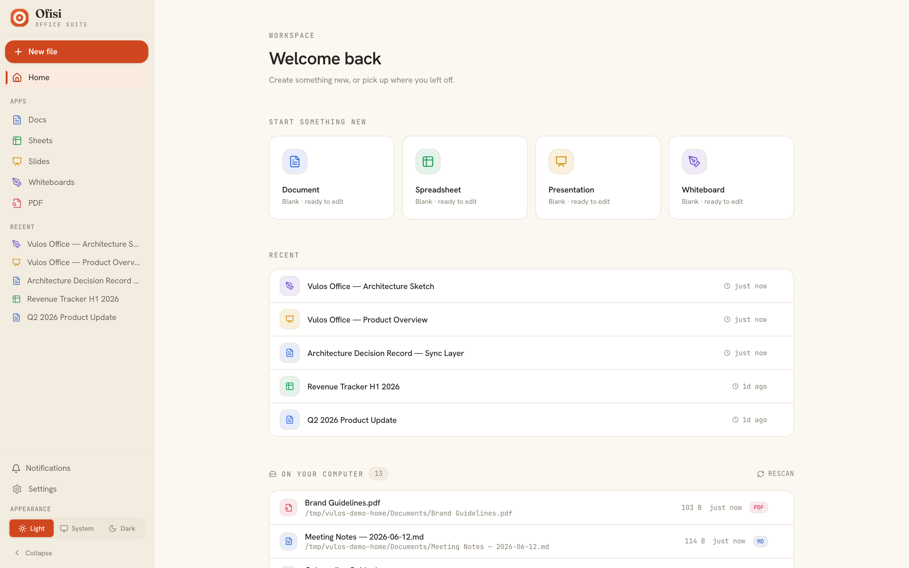
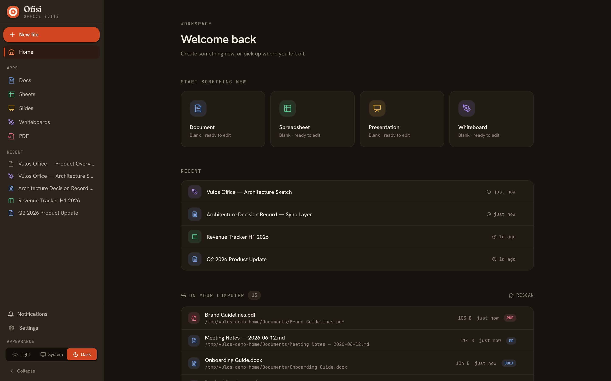
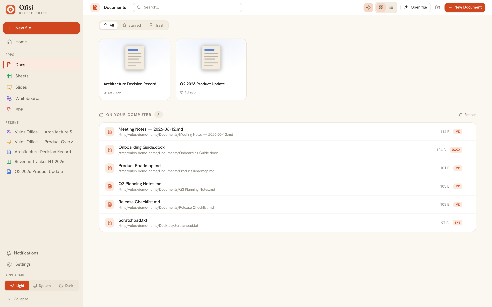
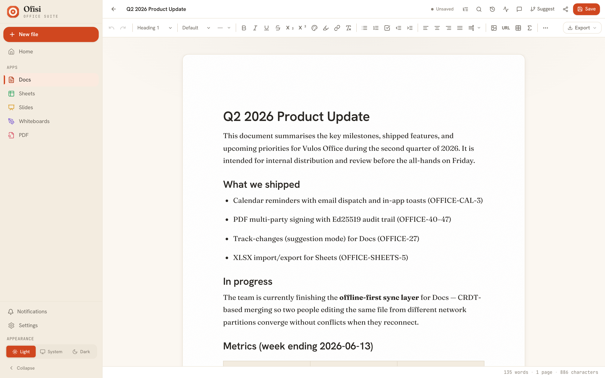
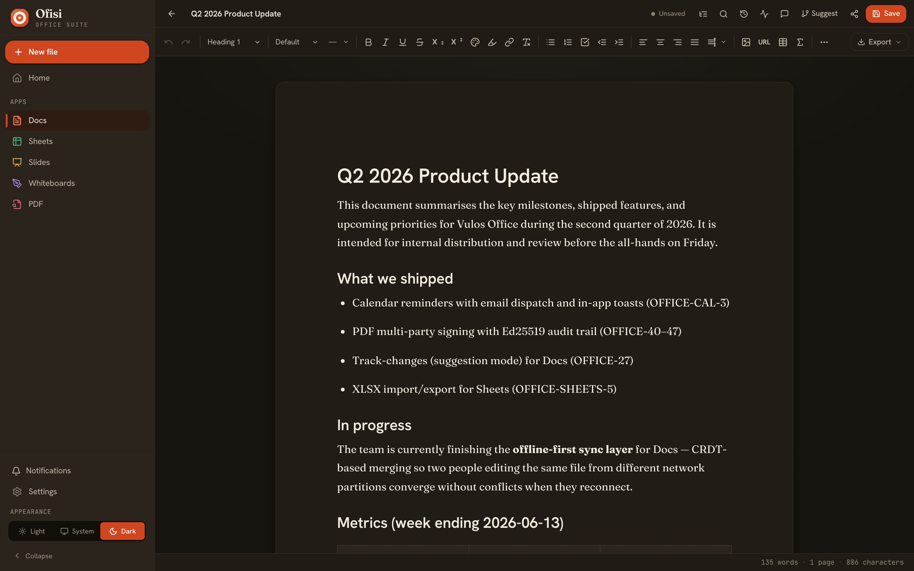
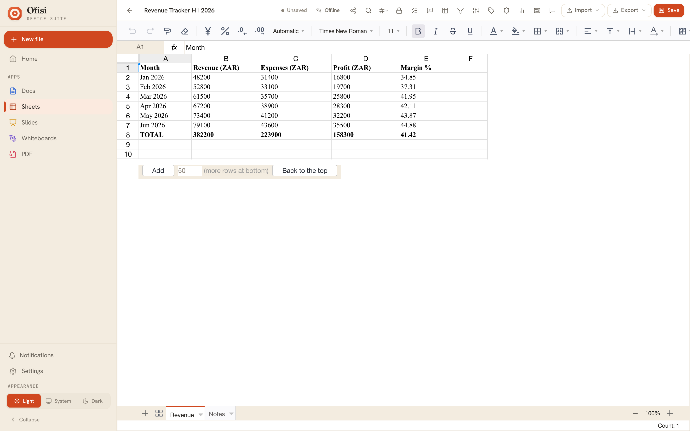
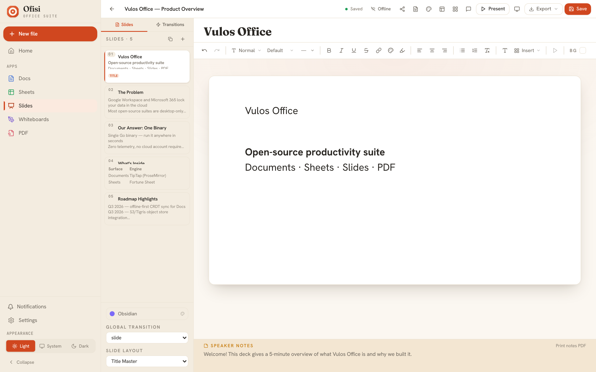
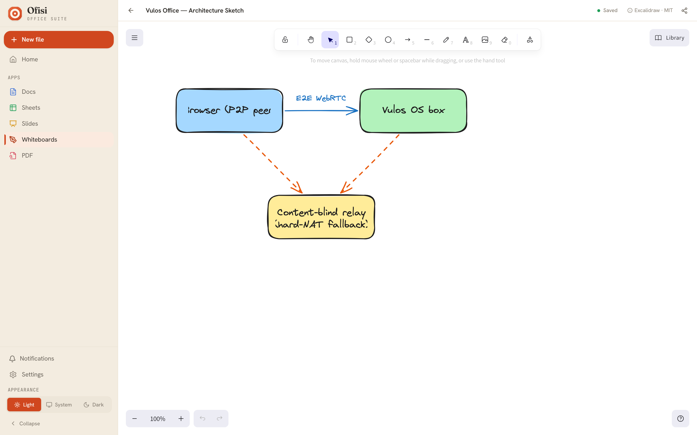
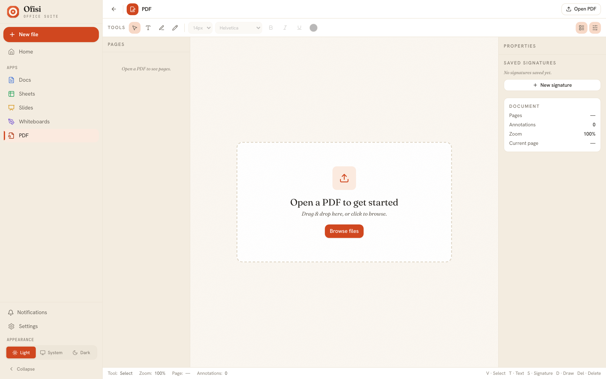
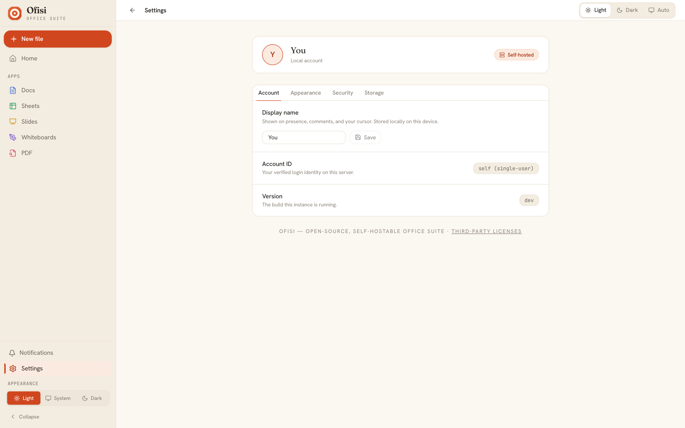

# Ofisi — Screenshots

This document describes the screenshot gallery, how screenshots are captured, and the seed data used to produce populated views.

---

## Prerequisites

```bash
# Install npm dependencies (including Playwright)
npm install

# Install Playwright's Chromium browser
npx playwright install chromium

# Build the frontend (the screenshotter uses the compiled binary + dist/)
npm run build:frontend
```

---

## Capturing screenshots

```bash
npm run screenshots
```

The screenshotter is self-contained — it:
1. Writes demo data files to `/tmp/vulos-demo-data/` (never touches `./data`)
2. Builds the Go binary (which embeds the frontend via `//go:embed`)
3. Starts the binary on port 8083 pointed at the demo data dir
4. Captures every surface at 1440×900 @2x (retina), in **light and dark** —
   Ofisi is light-first, so each surface is shot as both `<name>-light.png`
   and `<name>-dark.png`
5. Stops the server

To capture against a deployed instance:

```bash
BASE_URL=https://office.example.com npm run screenshots
```

---

## Seed data

Demo data is committed in `scripts/seed-demo.mjs` and never touches `./data` — it uses a temporary directory at `/tmp/vulos-demo-data`.

| Surface | Seed content |
|---------|-------------|
| **Docs** | "Q2 2026 Product Update" — headings, prose, bullet lists, table; "ADR-014: Sync Layer" — decision record |
| **Sheets** | "Revenue Tracker H1 2026" — 6 months × 5 columns, SUM + margin formulas, 2 sheets |
| **Slides** | "Ofisi Product Overview" — 5 slides, Reveal.js obsidian theme |
| **Whiteboards** | "Ofisi — Architecture Sketch" — Excalidraw scene: labelled boxes + E2E/relay arrows |

---

## Route list

Each route is captured twice — `<name>-light.png` and `<name>-dark.png`.

| File (light / dark) | Route | Surface | Populated? |
|---------------------|-------|---------|------------|
| `home-*.png` | `/` | Home / workspace | Yes — seeded recents + "Start something new" |
| `apphome-docs-*.png` | `/docs` | Docs file list | Yes — seeded docs + local-drive scan |
| `docs-editor-*.png` | `/docs/demo` | Documents editor | Yes — Q2 Product Update with prose + table |
| `sheets-editor-*.png` | `/sheets/demo-sheet` | Spreadsheets editor | Yes — Revenue Tracker with formulas |
| `slides-editor-*.png` | `/slides/demo-slides` | Presentations editor | Yes — 5-slide product overview |
| `whiteboard-editor-*.png` | `/whiteboards/demo-board` | Whiteboard editor (Excalidraw) | Yes — architecture sketch on the real canvas |
| `pdf-editor-*.png` | `/pdf/demo` | PDF viewer/annotator | Partial — UI shell (open-a-PDF empty state) |
| `settings-*.png` | `/settings` | Settings | Yes — account / storage / admin |

The README hero uses `home-light.png`; the gallery leads with the light shots
and shows a light/dark pair.

---

## Gallery

### Home / workspace




The Ofisi workspace — "Start something new" launchers, seeded recents, and the
local-drive scan — in the warm light theme and its dark counterpart.

### Docs file list



The Docs app home: recent documents as cards plus the on-your-computer file scan.

### Docs Editor




The Documents editor (TipTap) open on "Q2 2026 Product Update" — the Fraunces
"paper", headings, a metrics table, and bullet lists.

### Sheets Editor



The Spreadsheets editor (Fortune Sheet) with the "Revenue Tracker H1 2026" — 6 months of revenue, expenses, profit (SUM formula), and margin % columns.

### Slides Editor



The Presentations editor open on the 5-slide "Ofisi Product Overview" deck — masters, themes, transitions, and presenter view.

### Whiteboard Editor



The Whiteboard editor — the MIT [Excalidraw](https://github.com/excalidraw/excalidraw) canvas mounted on Ofisi's own distributed peer-to-peer collab engine (the same Yjs/E2E-encrypted room Docs uses, no central whiteboard server). Shown open on the seeded "Architecture Sketch". Note the "Excalidraw · MIT" attribution in the top bar.

### PDF Editor



The PDF viewer with annotation and signing tools, shown on its open-a-PDF empty state. (A PDF file must be opened or uploaded to show content — the seed data does not include a pre-loaded PDF.)

### Settings



Standalone settings — account, storage, theme (light / dark / system), and admin.

> **Calendar and Contacts** moved to the mail connector — their screenshots
> and seed data now live with lilmail, not here.
